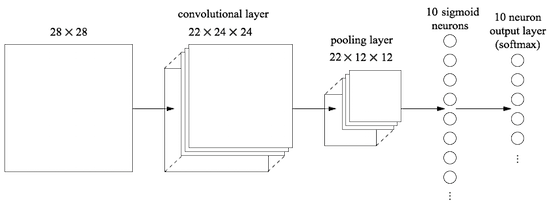

# Convolutional Neural Network (CNN) image classification of handwritten digits in Xilinx FPGA

This project was developed for the Hardware-Software Co-Design course. It consists on classifying 28×28 grayscale images of handwritten digits from the [MNIST dataset](http://yann.lecun.com/exdb/mnist/) using a trained CNN whose design was proposed [here](http://neuralnetworksanddeeplearning.com/chap6.html). The objective is to implement the algorithm in a Hardware-Software architecture, for a Xilinx FPGA (Zybo), in order to speedup its performance in comparison with the only software version.  

## CNN architecture

## Input files

**wb.bin** -> Binary file with 22 + 22*5*5 + 10 + 10*22*12*12 floating-point neural net weights 

**t100-images-idx3-ubyte** -> Contains header (16 bytes) plus 100 example images (100*28*28 bytes)

## Software version only

In the sw-only folder, there are the C scripts that are supposed to run only in the FPGA ARM processor (using the Xilinx SDK toolchain). The performance obtained through this version works as a baseline for calculating the speed-up of the Hardware-Software version.

## Hardware-Software version